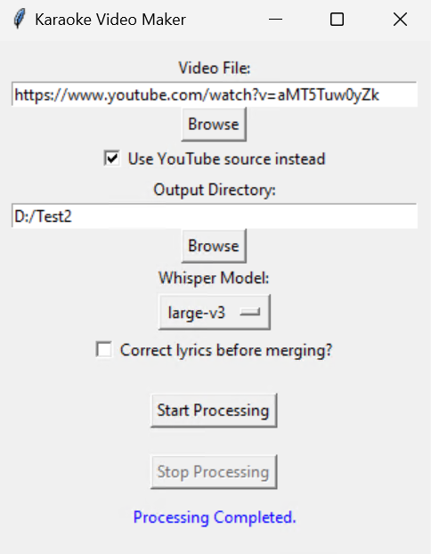

# Ketengan-Labs present Karaoke Video Clip Maker

A software to make a Karaoke Video with flowing lyrics and separated and user choosen audio between intrumental only and original audio with UI for easy interfacing. The output video is processed video with flowing lyrics and two audio in one video, first one is instrument only audio with no vocal and second audio is the original audio from the source

The script utilizing the power of stable whisper for creating the "flowing lyrics karaoke effect" like with acceptable timestamp, also demucs to separating the vocal and the instrument. The script also supporting the input from local video files, and Youtube powered by pytube.

Tested on CUDA and CPU with Windows operating system.

## Features
- **Video input**: Currently this script only supporting .mp4 and .mkv which is what most people used nowdays
- **Output Files**: The output adapting the source container
- **Youtube Support**: The user can throw the youtube link on the "input video" text box, and make sure to checklist "Use YouTube source instead". Currently we did not support HD video, but we will planned to be implemented
- **Easy User Interface**: By utilizing tkinter UI as user interface, the usage of this script should be easy
- **Correct lyrics Manually**: For advanced user, the user could manually
- **Adjustble Whisper model**: We supporting a wide variety of whisper model, so the user could choose which whisper model between accuracy and resource saving

## How to run
- Python 3.10 and CUDA GPU is required to run this script. You can download Python here https://www.python.org/downloads/windows/. If you didn't have GPU or not properly utilized, the script will run on CPU instead
- ffmpeg for windows must be added into PATH. You can download here https://www.gyan.dev/ffmpeg/builds/packages/ffmpeg-2024-05-13-git-37db0454e4-full_build.7z

## Disclaimer
This script still under development, other feature maybe will come soon.

